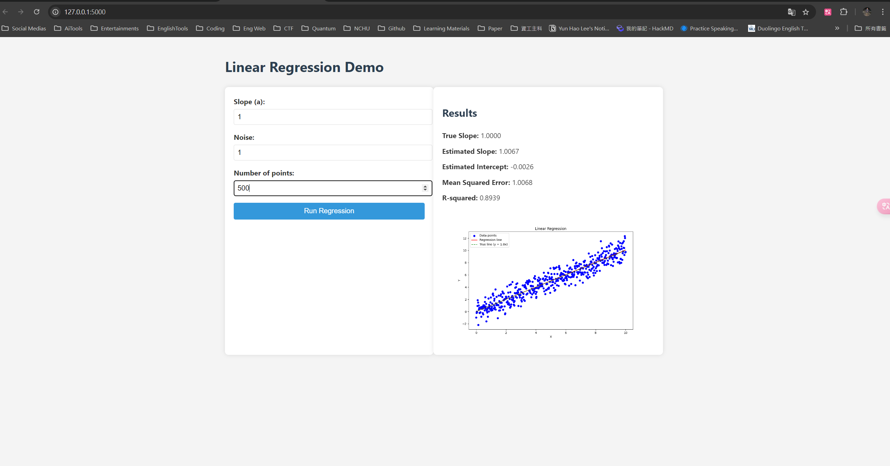

# Prompt and Process

## First Prompt
I want you be an expert on linear regression and website designer, to solve a simple linear regression problem which is following CRISP-DM and must have comment in code. In addition, user can modify a in ax+b, noise and number of points. Lastly, demo with python flask !

## AI Respond

## Second Prompt
perfect!
could you make UI looks better?

## AI second respond

## Third Prompt
I meet this bug 
UserWarning: Starting a Matplotlib GUI outside of the main thread will likely fail.

and it cause 

RuntimeError: main thread is not in main loop
Tcl_AsyncDelete: async handler deleted by the wrong thread

## AI Respond

## Fourth Prompt
I want you to modify the code not allow to adjust b in ax+b and just show where are modified

## AI Respond

## Result
